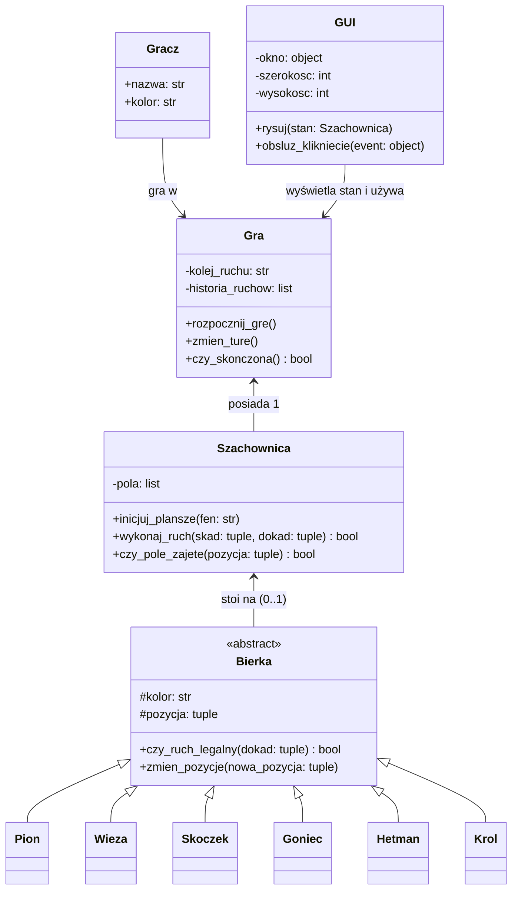

```mermaid
classDiagram
    Bierka <|-- Pion
    Bierka <|-- Wieza
    Bierka <|-- Skoczek
    Bierka <|-- Goniec
    Bierka <|-- Hetman
    Bierka <|-- Krol

    Gra <-- Szachownica : posiada 1

    Szachownica <-- Bierka : stoi na (0..1)

    Gracz --> Gra : gra w

    GUI --> Gra : wyświetla stan i używa

    class Gra {
        -kolej_ruchu: str
        -historia_ruchow: list
        +rozpocznij_gre()
        +zmien_ture()
        +czy_skonczona() bool
    }

    class Szachownica {
        -pola: list
        +inicjuj_plansze(fen: str)
        +wykonaj_ruch(skad: tuple, dokad: tuple) bool
        +czy_pole_zajete(pozycja: tuple) bool
    }

    class Bierka {
        <<abstract>>
        #kolor: str
        #pozycja: tuple
        +czy_ruch_legalny(dokad: tuple) bool
        +zmien_pozycje(nowa_pozycja: tuple)
    }

    class Gracz {
        +nazwa: str
        +kolor: str
    }

    class GUI {
        -okno: object
        -szerokosc: int
        -wysokosc: int
        +rysuj(stan: Szachownica)
        +obsluz_klikniecie(event: object)
    }
```